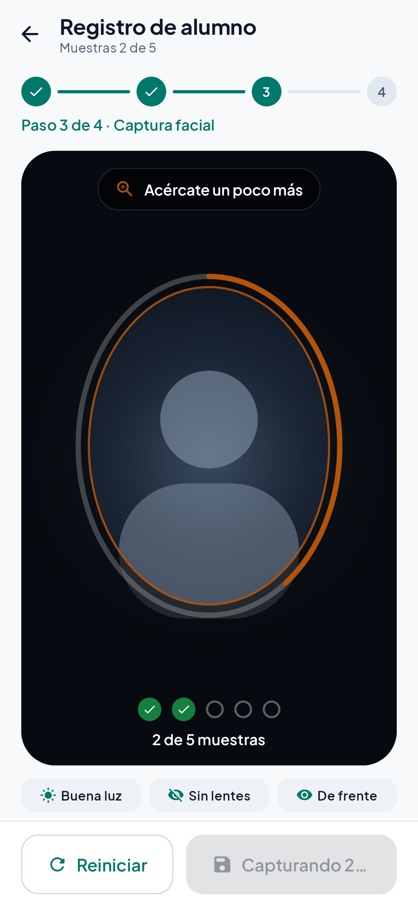
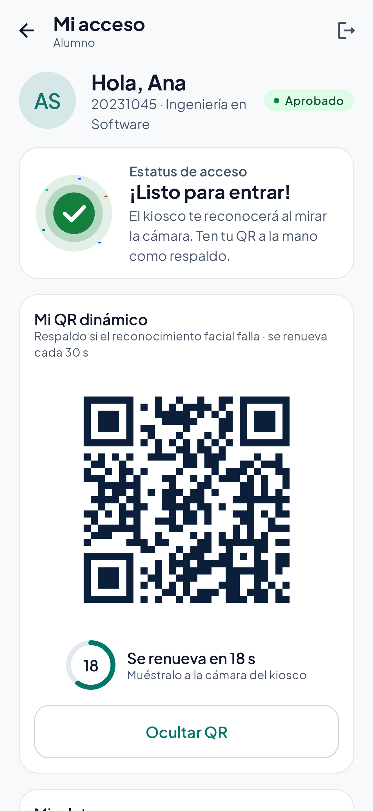

# Acceso UTCJ — Control de acceso facial para campus

App Android nativa para verificar el acceso de alumnos a la **Universidad Tecnológica de Ciudad Juárez (UTCJ)** mediante reconocimiento facial en el dispositivo, con respaldos por huella y QR dinámico, bitácora auditable y un panel administrativo adaptable a teléfono, tableta y kiosco.

> Motor facial preferido: **MobileFaceNet (TFLite)**; si el modelo no está en assets, se usa un histograma legado (ver **Limitaciones** y `scripts/download_mobilefacenet.sh`). La marca es configurable (*white-label*): ver [Cambiar la marca](#cambiar-la-marca-white-label).

## Capturas de pantalla

Generadas con Roborazzi (Robolectric, sin emulador) y datos ficticios — ver [TESTING.md](TESTING.md#4-capturas-de-pantalla-roborazzi).

| Bienvenida | Selección de rol | Registro: captura facial | Mi acceso + QR dinámico |
|---|---|---|---|
|  |  |  |  |

| Kiosco en espera (horizontal) | Acceso permitido | Acceso denegado |
|---|---|---|
|  |  |  |

| Inicio de sesión del guardia | Bloqueo por intentos | Panel (teléfono) | Panel (modo oscuro) |
|---|---|---|---|
|  |  |  |  |

| Panel en tableta (cajón permanente) |
|---|
|  |

| Alumnos | Bitácora | Configuración | Rol (oscuro) |
|---|---|---|---|
|  |  |  |  |

## Características

| Área | Qué hace |
|---|---|
| Diseño | Sistema de diseño propio (Material 3): tema claro/oscuro/sistema, tipografía Plus Jakarta Sans incluida (sin internet), tokens de espaciado y formas, componentes reutilizables (KPI, chips de estatus, estados vacíos ilustrados, *skeletons*, diálogos de confirmación), movimiento reducido respetado, textos 100 % en español |
| Primer uso | *Splash* de Android 12+, 3 páginas de bienvenida y selección de rol con tarjetas ilustradas |
| Alumno | Asistente por pasos **Datos → Consentimiento → Captura facial → Listo** con óvalo guía, anillo de progreso, chips de guía («Acércate», «Mejora la iluminación»…), 3–5 muestras; pantalla **Mi acceso** con estatus, **QR dinámico** con anillo de cuenta regresiva y **Eliminar mis datos** |
| Kiosco | Horizontal por defecto (configurable), inmersivo y siempre encendido; reloj, fecha, marca y estado de conexión; estado de espera «Acércate a la cámara»; resultado a pantalla completa verde/rojo con animación, nombre, matrícula, iniciales, hora y motivo; alternativas **Huella / QR / Llamar al guardia** (crea una incidencia); regreso automático configurable (10 s por defecto); vibración y tono opcional |
| Guardia | Contraseña PBKDF2-HMAC-SHA256 (sal aleatoria, 120 000 iteraciones); bloqueo de 5 min tras 5 intentos con **cuenta regresiva visual**; medidor de fortaleza al crear/cambiar contraseña; salir del kiosco exige contraseña |
| Panel administrativo | Navegación adaptable (barra inferior en teléfono, riel en tableta vertical, cajón permanente en tableta horizontal). **Inicio**: KPI (entradas hoy vs ayer, tasa de éxito, tiempo promedio, pendientes), gráficas animadas (accesos por hora, dona permitidos/denegados, tendencia de 7 días), actividad reciente y alertas (3+ fallos seguidos, fuera de horario). **Alumnos** con búsqueda sin acentos, filtros y hoja de detalle; **Aprobaciones** con contador; **Bitácora** con periodo (hoy / 7 / 30 días / personalizado), filtros, agrupación por día y exportación **CSV** y **PDF con marca**; **Visitantes**; **Incidencias**; **Configuración** agrupada |
| Reconocimiento | Alineación por ojos, **MobileFaceNet TFLite** o histograma legado, similitud coseno, umbral configurable con explicación (**0.60** por defecto; aviso si se baja), prueba de vida opcional |
| Privacidad | **Nunca se guardan fotos**: solo vectores cifrados AES-256-GCM (Android Keystore); consentimiento versionado; aprobación obligatoria; bitácora de solo lectura |
| Sin conexión | Todo funciona sin red; indicador reactivo *En línea / Sin conexión / Sincronizando / Pendientes: N*; cola WorkManager sin duplicados |
| Estatus institucional | CSV (muestra en `assets/` + importación); BAJA/SUSPENDIDO = sin acceso, y volver a registrarse **no** restablece ese estatus |

## Requisitos

- Android Studio Hedgehog (2023.1.1) o más reciente
- JDK 17
- Android SDK 34
- Dispositivo físico con cámara frontal (recomendado; el emulador sirve para la UI, no para el reconocimiento)
- minSdk 26 (Android 8.0)

## Compilar y ejecutar

```bash
git clone https://github.com/daniprogramming1/utcj-acceso-facial.git
cd utcj-acceso-facial
cp local.properties.example local.properties   # ajusta sdk.dir (Android Studio lo crea solo)
./scripts/download_mobilefacenet.sh            # opcional pero recomendado: modelo TFLite
./gradlew assembleDebug                        # APK en app/build/outputs/apk/debug/
./gradlew installDebug                         # instala en el dispositivo conectado
./gradlew testDebugUnitTest                    # pruebas unitarias + render de capturas
./gradlew recordRoborazziDebug                 # regenera docs/screenshots/*.png
```

### Modelo MobileFaceNet

El binario `.tflite` **no** se incluye en el repositorio. Ejecuta `./scripts/download_mobilefacenet.sh` para colocarlo en `app/src/main/assets/models/mobilefacenet.tflite`. Sin él, la app usa el motor legado y lo indica en Logcat. Tras cambiar de modelo, **los alumnos deben volver a registrarse**.

O ábrelo en Android Studio → *Open* → selecciona la carpeta → espera el **Gradle Sync** (descarga las nuevas dependencias) → *Run ▶*.

### Primer uso
1. Abre la app → recorre la bienvenida (o *Omitir*) → **Personal de seguridad** → define el nombre de la caseta y la contraseña (mínimo 6 caracteres).
2. El CSV de muestra (`app/src/main/assets/students_status.csv`) se importa automáticamente la primera vez.
3. En otro teléfono (o tras cerrar sesión): **Soy alumno** → Datos → Consentimiento → la app pide permiso de **cámara** → Captura facial.
4. Panel → **Aprobaciones** (el ícono muestra el número pendiente) → *Aprobar*.
5. Panel → **Modo kiosco** → el alumno se coloca frente a la cámara.
6. El alumno puede ver su estatus y su QR en **Soy alumno** (la app recuerda su matrícula) o en «¿Ya te registraste? Consulta tu estatus y QR».

## Firebase (opcional)

La app funciona 100 % sin conexión. Para sincronizar la bitácora con Firestore:

1. Crea un proyecto en [Firebase Console](https://console.firebase.google.com/) y registra la app Android con el paquete `edu.utcj.acceso` (y `edu.utcj.acceso.debug` para debug).
2. Descarga `google-services.json` a `app/` (está en `.gitignore`; **no lo subas**).
3. Descomenta en `build.gradle.kts` (raíz) `alias(libs.plugins.google.services) apply false`.
4. Descomenta en `app/build.gradle.kts` el plugin `alias(libs.plugins.google.services)` y las dependencias `firebase-bom` / `firebase-firestore`.
5. En `FirestoreDataSource.kt` cambia `FIRESTORE_COMPILED_IN = true` e implementa la escritura indicada en el comentario (`collection("access_events").document(syncKey).set(...)`). Usar `syncKey` como ID de documento hace que la escritura sea idempotente.

Mientras Firebase esté desactivado, el worker marca los eventos como sincronizados localmente para vaciar la cola.

## Estructura

```
app/src/main/java/edu/utcj/acceso/
  AccesoApp.kt, MainActivity.kt
  di/            Hilt: AppModule, DatabaseModule, SecurityModule
  data/local     Room: entidades, DAOs, AppDatabase, Converters
  data/remote    FirestoreDataSource, StudentStatusCsvDataSource
  data/repository Student, AccessLog, Auth, Sync, Settings, Visitor, Incident
  data/biometric FaceEmbeddingEngine (interfaz), MobileFaceNetEmbeddingEngine, LegacyHistogramEmbeddingEngine,
                 FaceAlignment, FaceQualityChecker, FaceMatcher, LivenessChecker, EmbeddingCrypto, QrTokenManager
  data/security  PasswordHasher, GuardAuthManager, SecurePrefs, KeyValueStore
  data/sync      SyncWorker, SyncQueue
  domain/model   Student, AccessEvent, Visitor, Incident, ConsentRecord, GuardSession
  brand/         BrandConfig (nombre, institución, colores, logo, soporte)
  domain/analytics DashboardCalculator, AlertsEngine (lógica pura, probada en JVM)
  domain/validation RegistrationValidator
  data/export    PdfReportBuilder (reporte PDF con marca)
  ui/theme       Color, Type (Plus Jakarta Sans), Shape, Spacing, Motion, Theme (claro/oscuro)
  ui/components  TopBar, Buttons, Cards (KPI), Labels (chips), Feedback (vacíos, skeleton, diálogos),
                 Inputs, ListItems, Charts (Canvas), FaceGuide, Illustrations, CameraPreview
  ui/            onboarding, role, student, guard, kiosk, admin (AdminShell + secciones), navigation
  util/          WindowSizeClass, TimeUtil, Initials, AppResult
```

Más detalles en [ARCHITECTURE.md](ARCHITECTURE.md). Guía de pruebas en [TESTING.md](TESTING.md).

## Cambiar la marca (white-label)

Todo lo visible de la marca vive en un solo lugar:

1. **`app/src/main/java/edu/utcj/acceso/brand/BrandConfig.kt`**: `APP_NAME`, `INSTITUTION_NAME`, `INSTITUTION_SHORT`, `TAGLINE`, `SUPPORT_EMAIL`, `SUPPORT_WEBSITE`, `SECURITY_DESK_LABEL`, `TIME_ZONE_ID` y la paleta `BrandPalette` (primario, secundario, acento, azul marino). El tema claro/oscuro, el kiosco, el PDF y las ilustraciones se derivan de ahí.
2. **Logo**: reemplaza `res/drawable/ic_brand_logo.xml` (vector; o apunta `BrandConfig.logoRes` a otro recurso).
3. **Ícono del launcher**: `res/drawable/ic_launcher_background.xml`, `ic_launcher_foreground.xml` y `ic_launcher_monochrome.xml` (ícono temático de Android 13).
4. **Splash y colores XML**: `res/values/colors.xml` (`brand_navy`, `window_background_*`) y `res/values/themes.xml`.
5. **Nombre en el launcher**: `app_name` en `res/values/strings.xml`.
6. **Paquete** (opcional, para publicar otra app): `namespace`/`applicationId` en `app/build.gradle.kts`.
7. Ejecuta `./gradlew recordRoborazziDebug` para regenerar las capturas con la nueva marca.

> `SUPPORT_EMAIL` (`soporte.acceso@utcj.edu.mx`) y el logo angular son **provisionales**: confírmalos/reemplázalos por los oficiales antes de distribuir.

## Limitaciones conocidas

- **Embeddings faciales**: con `mobilefacenet.tflite` en assets se usa MobileFaceNet (TFLite, ~192-d). Sin el archivo (o con «motor legado» en Configuración) se usa histograma 16×16 + geometría ML Kit (268-d). Ambos se L2-normalizan y se comparan por coseno; **no mezcles** vectores de distintos motores — hay que **volver a registrar** a los alumnos tras el cambio. Umbral por defecto **0.60** (MobileFaceNet); legado ~**0.72**.
- **Huella**: BiometricPrompt valida una huella enrolada **en el dispositivo**, no identifica a un alumno concreto; se registra como respaldo con el guardia en turno.
- **QR dinámico**: el secreto HMAC es local al dispositivo; el QR se valida en el mismo kiosco o en dispositivos que compartan el secreto. Además, quien conozca una matrícula **aprobada** puede abrir «Mi acceso» en ese dispositivo y generar su QR (no hay autenticación del alumno). Para producción: QR emitido por servidor o ligado a una sesión del alumno.
- **Inicio del alumno**: la app recuerda solo la matrícula (sin biometría) para mostrar estatus/QR; «Salir» o «Eliminar mis datos» la olvidan.
- **Cambios de comportamiento en este rediseño**: el kiosco regresa a la cámara a los **10 s** (antes 30 s; configurable 5/10/15/30 s), arranca en **horizontal** (configurable) y el resultado ya no es una pantalla aparte sino una capa sobre el kiosco. La app ahora **solicita el permiso de cámara** en tiempo de ejecución (antes no lo pedía).
- La app no reemplaza un control de acceso físico certificado.

## Privacidad

- No se guardan fotografías: los frames de cámara existen solo en memoria.
- Los embeddings se cifran con AES-256-GCM usando una clave no exportable del Android Keystore.
- Respaldo en la nube (`allowBackup`) desactivado; preferencias y base de datos excluidas de backup/transferencia.
- «Eliminar mis datos» borra el registro del alumno y todos sus embeddings (la bitácora se conserva por seguridad institucional).
- Volver a registrarse no reinicia un estatus BAJA/SUSPENDIDO a PENDIENTE.

## Licencias de terceros

- Tipografía **Plus Jakarta Sans** — SIL Open Font License 1.1 (`docs/licenses/PlusJakartaSans-OFL.txt`).
